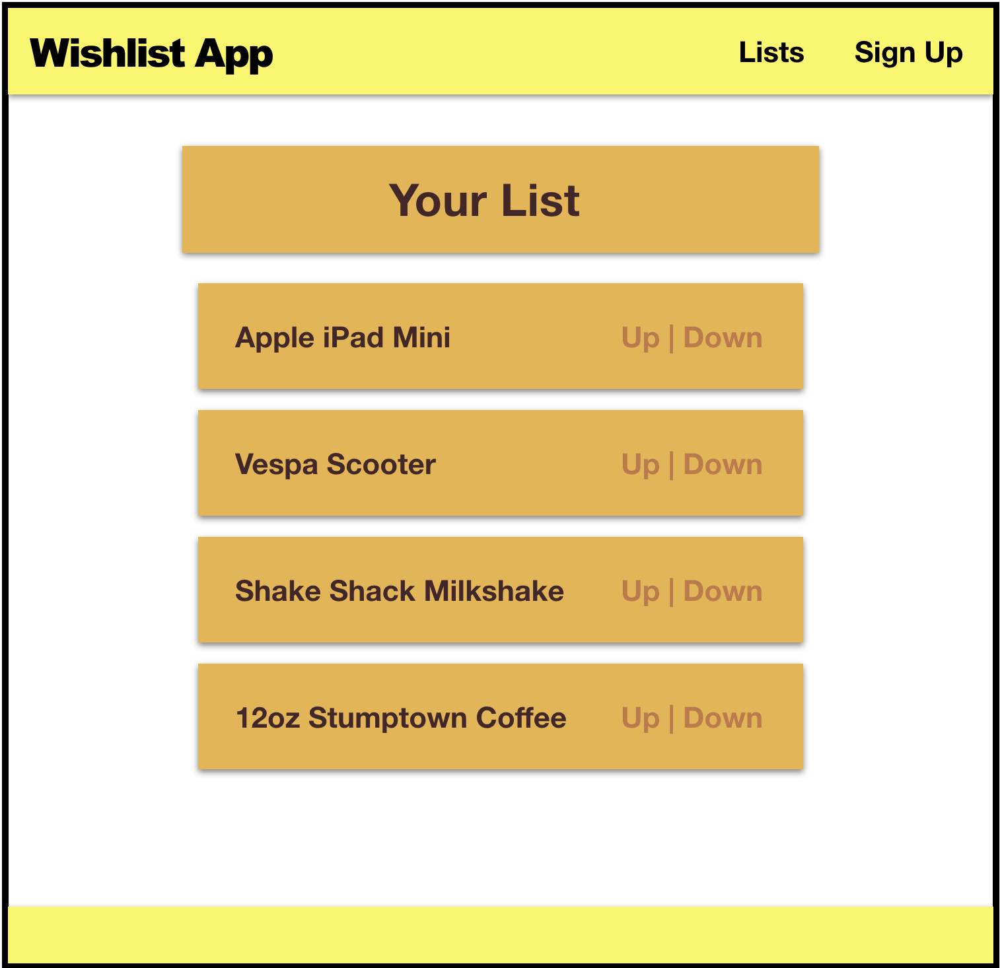

#   SOFTWARE ENGINEERING IMMERSIVE

1. Fork
1. Feature
1. Clone
1. Pull Request


# [Create React App](https://facebook.github.io/create-react-app)



## Start Here

Inside this repo, run the following command to create a new react app:

```sh
npx create-react-app my-book
```

> `npx` is a tool for running JavaScript npm modules that are intended for use as commands.

Use `npm start` to start a server that will serve your new React application:

```bash
cd my-book
npm start
```

You can view the app at `http://localhost:3000`

> Note: If you ever need to stop the server, you can hit `ctrl-c` in the terminal window.

Your job will be to implement the following:

1. A Header component
1. A List component
1. An Item component
1. A Footer component

Your App component will have three children: Header, List, and the Footer component.
The List component will have a child component, the Item component.

**Required**
- Your app should resemble the mockup as closely as possible.

**Tips:**
- Use Flexbox
- [Here is the color palette](https://mycolor.space/?hex=%23000000&sub=1)

